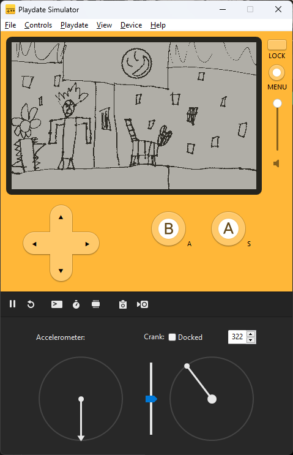

# What is this?

I have a [Playdate](https://play.date/) console and wanted to write a game for it. My daughter hand-drew the background art and I added silly sounds just to learn what is going on.

It may become more than that over time.

# I don't have a Playdate. Can I run it?

Yes! You'll need to install the [Playdate SDK](https://play.date/dev/) which comes with a simulator bundled. After that, simply run:

```sh
# You'll also have to have Node.js / npm for this because I'm lazy and used it for scripts.
# It's silly that `run` is duplicated, I know.
npm run run
```

Without `npm`, you  can inspect [package.json](package.json) to see what commands you need to run to build and simulate it.


